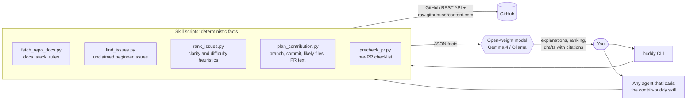

# contrib-bud

**From zero to your first pull request on any GitHub repo, with an open-weight model as your mentor.**

contrib-buddy reads a repo's README, CONTRIBUTING and templates, finds beginner issues nobody has claimed yet, and writes a step-by-step plan: commands, branch name, commit message and a PR description that uses the repo's own template. It ships two ways: as an **[Agent Skill](https://agentskills.io)** that any compatible agent can load, and as a **`buddy` CLI** powered by **Gemma 4** (or any local model via Ollama).

> It only advises and drafts. It never opens PRs, posts comments or pushes code. You do.

## Demo

<!-- TODO: replace with a 30-second GIF (e.g. recorded with vhs or asciinema) -->
`[ 30-second demo GIF goes here ]`. Until then, see [`demo/sample-output.txt`](demo/sample-output.txt) and [`demo/sample-plan.md`](demo/sample-plan.md).

## Quickstart

```bash
git clone https://github.com/YOUR-USER/contrib-buddy && cd contrib-buddy && pip install -e .
export GEMINI_API_KEY=your-key        # free at https://aistudio.google.com/apikey
buddy analyze mermaid-js/mermaid      # then: buddy issues <repo>, buddy plan <issue-url>
```

No key? Use `BUDDY_PROVIDER=ollama` (local, offline) or add `--no-ai` to see the facts only. If `buddy` is not on your PATH, use `python -m buddy`.

### Prefer a browser?

```bash
buddy web        # or double-click start-web.bat on Windows
```

This opens a local page at http://127.0.0.1:8765. Paste a repo link to see how to contribute and which issues are free. Click an issue to get a plan you can copy or download. You can also paste an issue link directly. It runs only on your machine, and your keys stay in `.env`.

## How it works



1. **Scripts gather facts.** Every repo fact (commands, rules, issues, files) comes from GitHub data, and each one carries its source file.
2. **The model does the language work.** It explains guidelines in plain English, ranks and explains issues, and drafts the approach and PR text. Prompts ([`buddy/prompts/`](buddy/prompts/)) require it to cite `[CONTRIBUTING.md]`, `[#123]` and the like, and to say "not found" instead of guessing.
3. **Structured output is checked.** Ranking and plan responses are JSON, validated against the real issue numbers and retried once. If they're still invalid, the CLI falls back to the heuristic ranking.

| Command | Facts (scripts) | Model's job |
|---|---|---|
| `buddy analyze <owner/repo>` | README, CONTRIBUTING, templates, stack, test/lint commands, rules | Plain-English "how to contribute here" |
| `buddy issues <owner/repo>` | Beginner-labelled issues minus assigned / linked-PR / recently claimed; heuristic scores | Rank, explain each issue, recommend one |
| `buddy plan <issue-url>` | Branch name, setup/test commands, likely files, commit style, PR template | Issue-specific approach, PR summary, claim comment |
| `buddy check` | Diff size, commit style, DCO, issue link, PR template, runs lint/tests | Explain each failure and how to fix it |

## Agent skill vs. CLI

- **As an Agent Skill:** copy or symlink [`contrib-buddy/`](contrib-buddy/) into your agent's skills directory. The agent reads [`SKILL.md`](contrib-buddy/SKILL.md), runs the scripts for facts and does the explaining itself. The skill follows the [Agent Skills specification](https://agentskills.io/specification) and CI validates it with `skills-ref`.
- **As a CLI:** `buddy` runs the same scripts and uses an **open-weight** model for the language work, with no proprietary agent runtime required.

## Open models used, and why

| Provider | Default model | Why |
|---|---|---|
| `gemma` (default) | `gemma-4-26b-a4b-it` via the Gemini API | Gemma 4 is open-weight. The 26B MoE variant is fast and good at following JSON instructions, and the free API tier means no GPU is needed. |
| `ollama` | `gemma4` (any Ollama model works, e.g. `qwen3`, `llama3.3`) | Fully local and offline. Your data never leaves your machine. |

The same weights run on both paths, so a demo on the hosted API reproduces locally.

## Configuration

| Variable | Default | Purpose |
|---|---|---|
| `BUDDY_PROVIDER` | `gemma` | `gemma` or `ollama` |
| `GEMINI_API_KEY` | – | Required for `gemma` |
| `BUDDY_MODEL` | `gemma-4-26b-a4b-it` / `gemma4` | Override the model (e.g. `gemma-4-31b-it`) |
| `OLLAMA_HOST` | `http://localhost:11434` | Ollama server URL |
| `GITHUB_TOKEN` | – | Optional; raises the GitHub limit from 60 to 5000 requests/hour (no scopes needed) |
| `CONTRIB_BUDDY_NO_CACHE` | – | Set to disable the 15-minute GitHub response cache |

Variables can also go in a `.env` file (see [`.env.example`](.env.example)).

## Limitations

- **Heuristics, not understanding.** "Likely files" uses keyword matching over file paths, not code search, and the clarity/difficulty scores are rough. The model refines them, but always read the code yourself.
- **Claim detection** reads comments from the last 14 days in English only. Linked PRs are detected through GitHub search's `-linked:pr` qualifier.
- **Rule extraction** is pattern-based (DCO, CLA, Conventional Commits, issue linking…). Unusual wording can be missed, so skim CONTRIBUTING anyway.
- **Rate limits:** without `GITHUB_TOKEN`, one `analyze` + `issues` + `plan` run uses roughly 10–20 of your 60 requests/hour.
- Model output can still be wrong despite the citations. contrib-buddy drafts; you review.
- **Hacktoberfest 2026** no longer counts PRs toward rewards ([hacktoberfest.com](https://hacktoberfest.com)). This tool is about real, useful contributions, not PR counts.

## Roadmap

- [ ] GitHub code search for "likely files" when a token is present
- [ ] `buddy respond <pr-url>`: help interpret review comments
- [ ] Non-English claim detection
- [ ] GitLab / Codeberg support
- [ ] Cache issue comments between `issues` and `plan`

Good first issues for *this* repo are listed in [CONTRIBUTING.md](CONTRIBUTING.md#good-first-issues).

## Development

```bash
pip install -e ".[dev]"
pytest -q && ruff check .
```

## License

[MIT](LICENSE)
